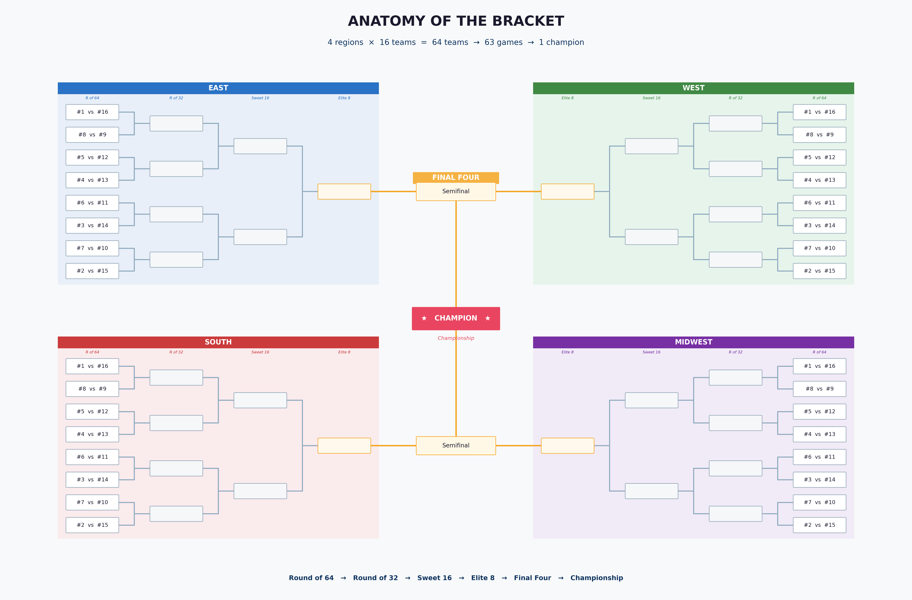
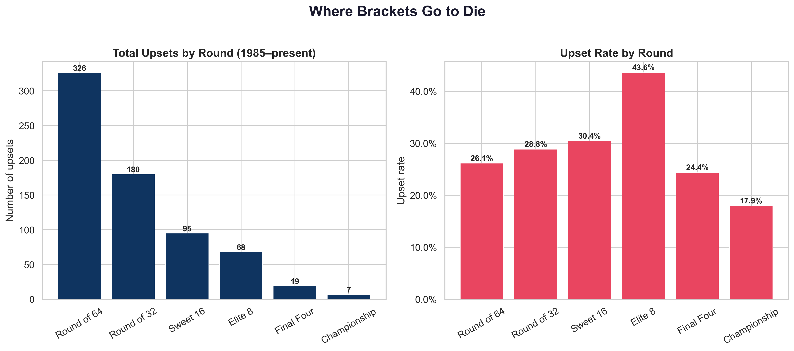
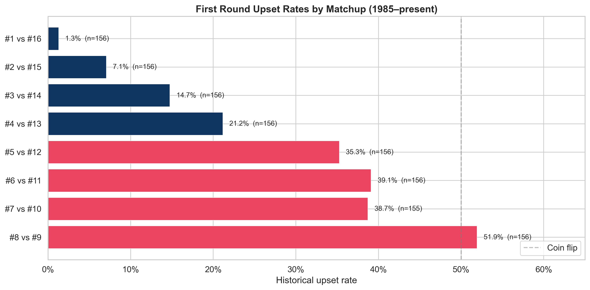
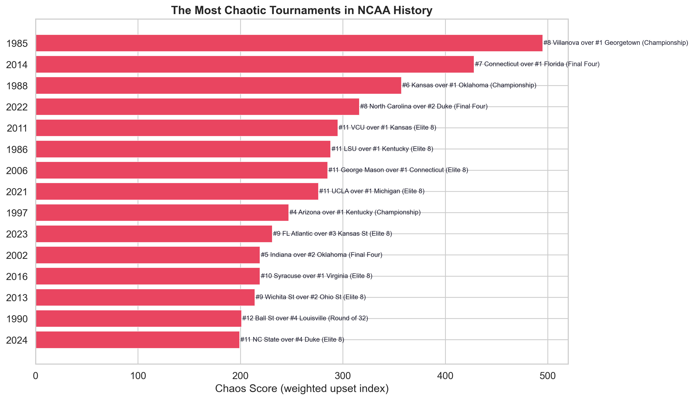
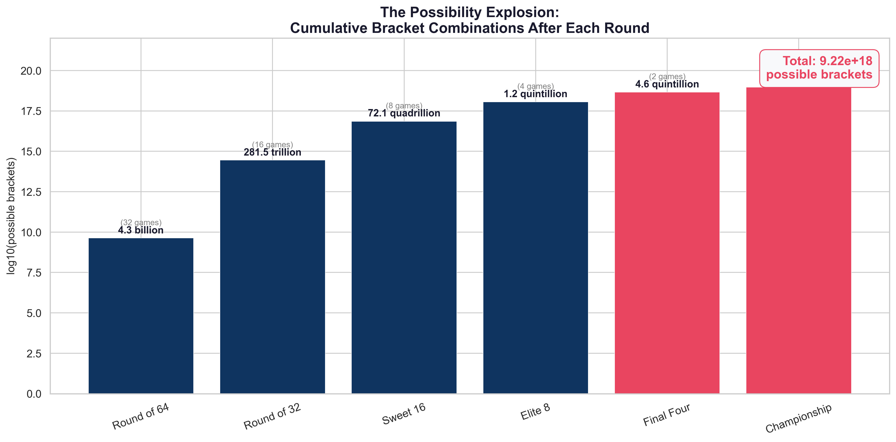
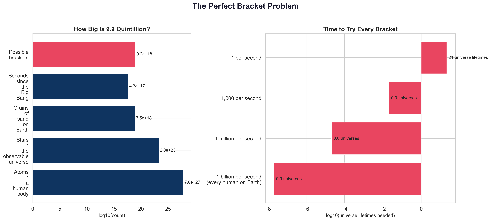
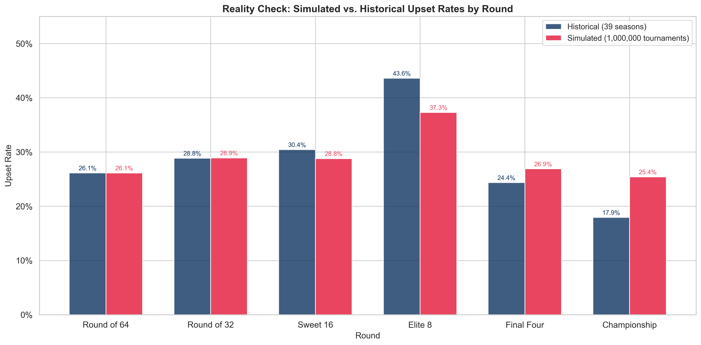
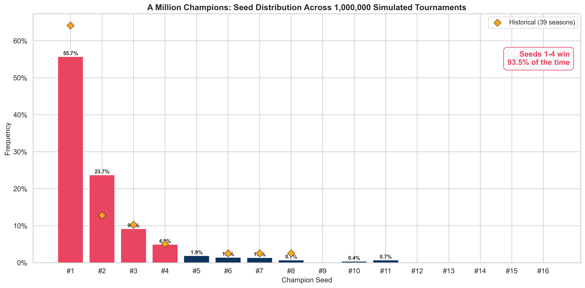

# March Madness and Chaos

**A data essay in three acts — why your bracket is always wrong.**

Every March, 64 college basketball teams get dropped into a single-elimination bracket — lose once, go home. The field splits into four regions (East, West, South, Midwest), each seeded #1 (best) through #16 (worst) — so there are *four* #1 seeds, not one, each region's own top dog. The four regional champions advance to the Final Four, and one team takes it all.

When a worse-seeded team beats a better one — #12 toppling #5, or #16 somehow knocking off #1 — that's an *upset*. A full bracket has 63 games — 63 chances for chaos.

<p align="center">
  
</p>

Tens of millions of people try to predict every game before tip-off. Almost every single one of them is wrong within 24 hours.

We wanted to know *why* — and just how wrong. So we analyzed every tournament game since 1985, built a probability model from the historical results, and then simulated **one million tournaments** to see what chaos really looks like at scale.

The answer: the madness isn't a bug in the system. It *is* the system.

<p align="center">
  
</p>

---

## The Three-Act Story

We started by looking at what actually happened, then built a model to explain it, then let the model run wild.

### Act 1 — "How Brackets Die"

We dug into 39 years of real results to find where brackets fall apart. The tournament has six rounds — 64 teams are whittled down to one champion — and an *upset* happens whenever the lower-ranked team wins. So which rounds are the most dangerous? Which matchups should you never trust? Has it always been this unpredictable?

<p align="center">
  
  
</p>

**Turns out:**
- The **later rounds are deadlier** than the opening weekend — the Elite 8 (final 8 teams) has a 43.6% upset rate, nearly double the first round's 26.1%
- The **#8 vs #9 matchup is a pure coin flip** (51.9%) — stop agonizing over it, the rankings barely matter
- The **#5 seed is the biggest trap** in the bracket — they lose in the first round more often than any other top-half seed, despite everyone picking them to advance
- **March has always been mad** — upset rates haven't trended up or down in 39 years. Chaos is the one constant
- **1985 was peak chaos** — 8th-ranked Villanova beat #1 Georgetown for the national title

### Act 2 — "The Shape of Chaos"

OK, so brackets fail. But *why?* We built a probability model from the historical data and the answer turned out to be structural — a perfect bracket isn't just hard, it's cosmically, laughably impossible.

<p align="center">
  
  
</p>

**Turns out:**
- A bracket has 63 games, each with 2 outcomes — that's **9.2 quintillion** possible brackets, more than grains of sand on Earth
- **Being the top seed isn't enough** — #1 seeds have just a 14% chance of winning the championship. Even the best team in the field loses more often than it wins
- **The margins are razor-thin** — a #1 seed beats #16 about 99% of the time, but has only a 56% edge against a #2. "Best" and "great" are barely distinguishable
- Warren Buffett once offered **$1 billion for a perfect bracket**. Even if every human on Earth filled out a billion brackets per second, it would take longer than the age of the universe to try them all. He was never in any danger

### Act 3 — "Simulating the Madness"

Now for the fun part. We took our probability model and simulated a million tournaments — 63 million individual games — to see what the full landscape of chaos actually looks like. Think of it as running March Madness a million times and keeping score.

<p align="center">
  
  
</p>

**Turns out:**
- **The best teams still lose almost half the time** — #1 seeds win only 55.7% of simulated tournaments, despite being the top-ranked team in their region
- **There's no "right" bracket** — the Final Four (last 4 teams standing) produced 1,748 unique combinations across a million runs. The most common one showed up just 6.5% of the time
- **Cinderella is real** — a #11 seed (a team barely expected to survive round one) won the whole thing 6,833 times. Rare, but real
- **The truly impossible isn't quite impossible** — a #16 seed, the lowest-ranked team in the field, won the title twice in a million tries
- **And the simulation actually works** — its upset rates line up almost exactly with 39 years of real results

---

## Key Numbers at a Glance

| What | Number | So what? |
|------|--------|----------|
| Seasons analyzed | 39 (1985-2024) | The entire modern tournament era |
| Real games studied | 2,456 | Every matchup, every upset, every blowout |
| Simulated tournaments | 1,000,000 | Enough to catch even million-to-one flukes |
| Simulated games | 63,000,000 | Each decided by real historical probabilities |
| Possible brackets | 9.2 quintillion | More than grains of sand on Earth |
| Best team's title odds | 55.7% | Even #1 seeds lose almost half the time |
| Top 4 seeds' title share | 93.5% | Dominance is real — but far from guaranteed |
| Unique Final Fours seen | 1,748 | A million tries, almost two thousand different outcomes |
| Lowest seed to win it all | #16 (twice in 1M) | Two-in-a-million. But not zero |

---

## Want to Play With the Data Yourself?

If you want to explore the notebooks, tweak the model, or simulate your own million tournaments — here's how to get started:

```bash
uv sync                                    # Install dependencies
uv run python main.py                      # Quick smoke test
uv run jupyter notebook notebooks/act1_autopsy.ipynb   # Open any notebook
```

Requires **Python 3.13+** ([uv](https://docs.astral.sh/uv/)) and the [Kaggle March Machine Learning Mania](https://www.kaggle.com/competitions/march-machine-learning-mania-2024/data) CSV files placed in `data/raw/`.

**Want to understand the code?** See [CODEBASE.md](CODEBASE.md) for the full technical architecture, module APIs, data pipeline, and ideas for extending the project.

---

## License

This project is for educational and analytical purposes. The underlying data belongs to Kaggle / the NCAA. The analysis, code, and visualizations are original work.

---

*Built with Python, pandas, matplotlib, and a million rolls of the dice.*
